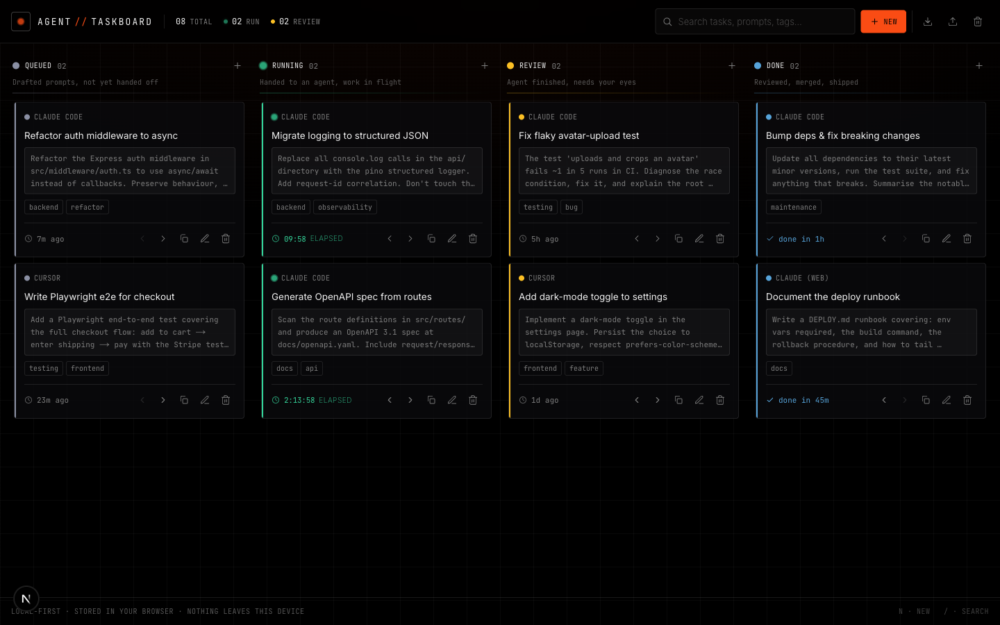

# Agent Task Board


**Mission control for the work you hand to AI coding agents.**

A local-first kanban for delegating tasks to AI agents (Claude Code, Cursor, Codex, Aider…). Queue a prompt, hand it off, watch what's running with live timers, review the result, and ship — all in your browser. Nothing leaves your machine.

<p align="center">
  
</p>

---

## Contents

- [Why](#why)
- [Features](#features)
- [Tech stack](#tech-stack)
- [Getting started](#getting-started)
- [Architecture](#architecture)
- [Testing](#testing)
- [Design system](#design-system)
- [Privacy](#privacy)
- [Roadmap](#roadmap)
- [Contributing](#contributing)
- [Code of Conduct](#code-of-conduct)
- [License](#license)

## Why

If you drive more than one AI agent at a time, the bottleneck stops being _writing_ prompts and becomes _tracking_ them: what's queued, what's actually running, what's waiting on your review, and what you can copy-paste again next week. Agent Task Board is a focused board for exactly that loop — **prompt-first cards** in four lanes that mirror the delegation lifecycle:

| Lane | Meaning |
| --- | --- |
| **Queued** | Drafted prompts, not yet handed off |
| **Running** | Handed to an agent, work in flight (live elapsed timer) |
| **Review** | Agent finished, needs your eyes |
| **Done** | Reviewed, merged, shipped (shows time-to-done) |

## Features

- **Prompt-first cards** — each card's payload is the reusable prompt you give the agent, shown in monospace with one-click **copy**.
- **Four-lane delegation flow** — Queued → Running → Review → Done, with zero-padded counts and a per-lane status colour.
- **Drag-and-drop** — reorder within a lane or move across lanes (pointer + full keyboard support via dnd-kit).
- **Move buttons** — `‹ ›` on every card for quick, touch-friendly lane changes.
- **Live timers** — Running cards tick up in real time; Done cards show how long the work took (tabular figures, no jitter).
- **Search** — filter across titles, prompts, agents, tags, and notes instantly.
- **Local-first** — everything is stored in `localStorage`. No account, no backend, no telemetry.
- **Export / Import** — back up or move your board as a JSON file.
- **Undo** — deletes and board-clears are undoable from a toast.
- **Keyboard shortcuts** — `n` to add a task, `/` to focus search, `⌘↵` to save, `Esc` to close.
- **Accessible & responsive** — labelled controls, visible focus rings, reduced-motion support, and a horizontal-scroll layout on mobile.

## Tech stack

- [Next.js 16](https://nextjs.org) (App Router, Turbopack) + React 19
- TypeScript
- Tailwind CSS v4
- [dnd-kit](https://dndkit.com) for drag-and-drop
- [Vitest](https://vitest.dev) + Testing Library for the core logic
- Visual language vendored from **[dragonfly-ds](#design-system)** — a dark, editorial design system (black canvas, hairline grid, single orange-red accent, three-face type system)

## Getting started

```bash
npm install
npm run dev
# open http://localhost:3000
```

The board seeds itself with a sample set of tasks on first visit. Clear it (trash icon) to start from an empty board; **Load sample board** brings the demo back.

### Scripts

| Command | Description |
| --- | --- |
| `npm run dev` | Start the dev server (Turbopack) |
| `npm run build` | Production build |
| `npm run start` | Serve the production build |
| `npm run lint` | ESLint |
| `npm run typecheck` | `tsc --noEmit` |
| `npm run test` | Run the Vitest suite |
| `npm run test:watch` | Vitest in watch mode |

## Architecture

The board is split into pure, framework-free logic and a thin React layer, which keeps the core fully unit-testable.

```
lib/
  types.ts      Domain types (Task, Status, BoardState)
  board.ts      Pure reducer: add / update / delete / move / commitDrag / reconcile
  columns.ts    Lane metadata (labels, hints, colours)
  time.ts       Timer & relative-time formatting
  storage.ts    localStorage persistence + JSON export/import
  seed.ts       Sample board
  useBoard.ts   useSyncExternalStore hook wrapping the store (SSR-safe)
components/
  ds/           Vendored dragonfly-ds primitives (Panel, Text, Button, Rule) + tokens
  BoardApp.tsx  Orchestrator: state, search, modals, toasts, shortcuts
  Board.tsx     DndContext + drag logic
  Column.tsx    A droppable lane
  TaskCard.tsx  The prompt-first card
  TaskModal.tsx Create / edit form
```

`BoardState` is modelled as a flat `tasks` map plus ordered id-lists per column — the canonical multi-container shape — so reorders and cross-lane moves are simple array splices and dnd-kit's `arrayMove` slots in cleanly.

## Testing

```bash
npm run test       # 32 unit tests across the reducer, storage, and time utils
npm run typecheck
npm run lint
npm run build
```

The reducer (move/commitDrag timestamping, reconcile/repair), storage round-trips (save/load/export/import), and time formatting are all covered. UI flows (create, move, copy, delete+undo, search, persistence, drag-and-drop) were verified end-to-end in the browser.

## Design system

The interface is built on a vendored copy of **dragonfly-ds** (in `components/ds/`): a dark editorial system with a black canvas, a faint 10%-white hairline grid, a single orange-red accent (`#fa4c14`), and a three-face type system (Fraunces / Inter / JetBrains Mono, self-hosted via `next/font`). Four sparing status hues — one per lane — are layered on top.

## Privacy

100% client-side. Your tasks and prompts live only in your browser's `localStorage` and are never sent anywhere. Use **Export** to keep a backup.

## Roadmap

The board is local-first today, which means an external agent can't read or claim tasks directly. The natural next step is **agent auto-pull** — letting real agents work the queue:

1. **A small server API** (Next.js Route Handlers over SQLite / Supabase / a JSON file):
   - `GET /api/tasks?status=queued` — the next task
   - `POST /api/tasks/:id/claim` — atomically move it to **Running** (so one task → one agent)
   - `PATCH /api/tasks/:id` — post the result, move it to **Review**
2. **A worker** that polls queued tasks, claims one, runs its prompt via the [Claude Agent SDK](https://docs.claude.com/en/api/agent-sdk/overview) or `claude -p "<prompt>" --output-format json` in the target repo, then sends the output back to the **Review** lane.
3. The **Review** lane is already the human approval gate before anything reaches **Done**.

Until that lands, **Export** the board to JSON and point a script at the queued prompts as a manual bridge.

## Contributing

Contributions are welcome! Please open an issue first to discuss what you'd like to change.

1. Fork the repo
2. Create a feature branch (`git checkout -b feature/your-feature`)
3. Make your change, adding tests for any new logic in `lib/`
4. Make sure `npm run lint`, `npm run typecheck`, `npm run test`, and `npm run build` all pass
5. Commit (`git commit -m 'feat: describe change'`), push, and open a pull request

## Code of Conduct

This project follows the [Contributor Covenant v2.1](https://www.contributor-covenant.org/version/2/1/code_of_conduct/).
By participating you agree to uphold a welcoming, harassment-free environment.

## License

Distributed under the MIT License. See [LICENSE](LICENSE) for details.
