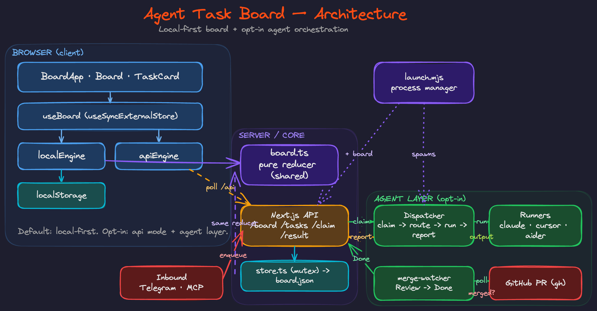

# Agent Task Board


**Mission control for the work you hand to AI coding agents.**

A local-first kanban for delegating tasks to AI agents (Claude Code, Cursor, Codex, Aider…). Queue a prompt, hand it off, watch what's running with live timers, review the result, and ship — all in your browser. Nothing leaves your machine.

<p align="center">
  
</p>

---

## Contents

- [Why](#why)
- [Features](#features)
- [Tech stack](#tech-stack)
- [Getting started](#getting-started)
- [Architecture](#architecture)
- [Testing](#testing)
- [Design system](#design-system)
- [Agent orchestration](#agent-orchestration)
- [Privacy](#privacy)
- [Contributing](#contributing)
- [Code of Conduct](#code-of-conduct)
- [License](#license)

## Why

If you drive more than one AI agent at a time, the bottleneck stops being _writing_ prompts and becomes _tracking_ them: what's queued, what's actually running, what's waiting on your review, and what you can copy-paste again next week. Agent Task Board is a focused board for exactly that loop — **prompt-first cards** in four lanes that mirror the delegation lifecycle:

| Lane | Meaning |
| --- | --- |
| **Queued** | Drafted prompts, not yet handed off |
| **Running** | Handed to an agent, work in flight (live elapsed timer) |
| **Review** | Agent finished, needs your eyes |
| **Done** | Reviewed, merged, shipped (shows time-to-done) |

## Features

- **Prompt-first cards** — each card's payload is the reusable prompt you give the agent, shown in monospace with one-click **copy**.
- **Four-lane delegation flow** — Queued → Running → Review → Done, with zero-padded counts and a per-lane status colour.
- **Drag-and-drop** — reorder within a lane or move across lanes (pointer + full keyboard support via dnd-kit).
- **Move buttons** — `‹ ›` on every card for quick, touch-friendly lane changes.
- **Live timers** — Running cards tick up in real time; Done cards show how long the work took (tabular figures, no jitter).
- **PR-aware cards** — when a task opens a pull request, the card surfaces a one-click **PR link** field; result text is expandable (show more/less) with clickable links.
- **Independent review gate (opt-in)** — before a PR opens, a _fresh_ agent that didn't write the code reviews the diff alongside the repo's own checks (`lint`/`typecheck`/`test`) and iterates fixes until the change clears a confidence gate — so you only ever review PRs that already passed. See [Independent review gate](#independent-review-gate-opt-in).
- **Compact Done lane + archive** — Done cards collapse to a one-line summary; **archive** finished cards behind a per-lane reveal (with restore) so the board never bloats.
- **Search** — filter across titles, prompts, agents, tags, and notes instantly.
- **Local-first by default** — the board lives in `localStorage`. No account, no telemetry.
- **Agent orchestration (opt-in)** — switch to a server-backed live board and let real agents work the queue: an **MCP server** to enqueue by talking to an agent, a **dispatcher** that claims tasks (with optional **concurrency**), routes each by `agent` label and a `/repo` slash command (or `repo:` tag) to the right repo, and — for code tasks — opens a **pull request automatically** in an isolated `git worktree` before the card lands in Review. A **Telegram bot** is your control surface. See [Agent orchestration](#agent-orchestration).
- **Export / Import** — back up or move your board as a JSON file.
- **Undo** — deletes and board-clears are undoable from a toast.
- **Keyboard shortcuts** — `n` to add a task, `/` to focus search, `⌘↵` to save, `Esc` to close.
- **Accessible & responsive** — labelled controls, visible focus rings, reduced-motion support, and a horizontal-scroll layout on mobile.

## Tech stack

- [Next.js 16](https://nextjs.org) (App Router, Turbopack) + React 19
- TypeScript
- Tailwind CSS v4
- [dnd-kit](https://dndkit.com) for drag-and-drop
- [Vitest](https://vitest.dev) + Testing Library for the core logic
- Visual language vendored from **[dragonfly-ds](#design-system)** — a dark, editorial design system (black canvas, hairline grid, single orange-red accent, three-face type system)

## Getting started

```bash
npm install
npm run dev
# open http://localhost:3000
```

The board seeds itself with a sample set of tasks on first visit. Clear it (trash icon) to start from an empty board; **Load sample board** brings the demo back.

### Scripts

| Command | Description |
| --- | --- |
| `npm run dev` | Start the dev server (Turbopack) |
| `npm run build` | Production build |
| `npm run start` | Serve the production build |
| `npm run lint` | ESLint |
| `npm run typecheck` | `tsc --noEmit` |
| `npm run test` | Run the Vitest suite |
| `npm run test:watch` | Vitest in watch mode |
| `npm run agents` | Bring up the whole control plane: board + dispatcher + Telegram bot ([details](#agent-orchestration)) |

## Architecture

The board is split into pure, framework-free logic and a thin React layer, which keeps the core fully unit-testable.

<p align="center">
  
</p>

```
lib/
  types.ts        Domain types (Task, Status, BoardState)
  board.ts        Pure reducer: add / update / delete / move / commitDrag / claimNext / setResult
  columns.ts      Lane metadata (labels, hints, colours)
  time.ts         Timer & relative-time formatting
  storage.ts      localStorage persistence + JSON export/import
  seed.ts         Sample board
  boardEngine.ts  Engine contract + EMPTY sentinel + mode flag
  localEngine.ts  Local-first engine (localStorage)
  apiEngine.ts    Live engine (server-backed, polls /api/board)
  useBoard.ts     useSyncExternalStore hook; selects the engine by mode
  server/         store.ts (file-backed, mutex-guarded), auth.ts, parse.ts  ← server-only
components/
  ds/             Vendored dragonfly-ds primitives (Panel, Text, Button, Rule) + tokens
  BoardApp.tsx    Orchestrator: state, search, modals, toasts, shortcuts
  Board.tsx       DndContext + drag logic
  TaskCard.tsx    The prompt-first card (renders the agent result)
app/api/          Route Handlers: board, tasks, claim, tasks/[id]/result
agent/
  launch.mjs        One command: board + dispatcher + watcher (`npm run agents`)
  dispatcher.mjs    Claim → route by agent → run → report (to board + Telegram)
  merge-watcher.mjs Move Review → Done when a card's PR is merged (polls `gh`)
  mcp-server.mjs    MCP stdio server exposing board tools
  telegram-bot.mjs  Inbound: messages → queued tasks
  launchd/          macOS LaunchAgent installer (run the whole control plane persistently)
  lib/              api.mjs (board client), telegram.mjs, prs.mjs, routes.mjs (routing + repo/PR helpers), git.mjs (worktree-isolated PR flow), message.mjs
```

`BoardState` is modelled as a flat `tasks` map plus ordered id-lists per column — the canonical multi-container shape — so reorders and cross-lane moves are simple array splices and dnd-kit's `arrayMove` slots in cleanly. The same pure reducer in `board.ts` backs both the browser (`localEngine`) and the server store, so the local and live boards behave identically.

## Testing

```bash
npm run test       # 133 unit tests: reducer (incl. archive), claim/result, storage, time, server store, agent routing/PR/repo-slug helpers, review-gate helpers, Telegram message parsing
npm run typecheck
npm run lint
npm run build
```

The reducer (move/commitDrag timestamping, atomic `claimNext`, `setResult`, reconcile/repair), storage round-trips, time formatting, and the server store (FIFO + concurrent-claim atomicity) are all covered. UI flows (create, move, copy, delete+undo, search, persistence, drag-and-drop) were verified in the browser, and the full agent loop (enqueue → dispatch → run → review) plus the MCP server were verified end-to-end against a live server.

## Design system

The interface is built on a vendored copy of **dragonfly-ds** (in `components/ds/`): a dark editorial system with a black canvas, a faint 10%-white hairline grid, a single orange-red accent (`#fa4c14`), and a three-face type system (Fraunces / Inter / JetBrains Mono, self-hosted via `next/font`). Four sparing status hues — one per lane — are layered on top.

## Privacy

100% client-side. Your tasks and prompts live only in your browser's `localStorage` and are never sent anywhere. Use **Export** to keep a backup.

## Agent orchestration

Beyond the manual board, Agent Task Board can run a full **delegate → dispatch → run → review** loop where real agents pull work off the queue. The pieces:

```
  Telegram ──▶ MCP / API ──▶ [ Queue ] ──▶ Dispatcher ──▶ runner (claude / cursor / …)
   (you)        (enqueue)                  (claim+route)      │
      ▲                                                       ▼
      └──────────── "picked up by X" / result ◀────── Review lane (your approval)
```

1. **You enqueue** — talk to the **Telegram bot** (or any MCP client via the MCP server, or `POST /api/tasks`). Your message becomes a queued task.
2. **The dispatcher claims it atomically** (one task → one agent), routes it to the right **runner** by the task's `agent` label, and notifies Telegram *"🟢 picked up → Claude Code"*.
3. **The runner executes** the prompt (e.g. `claude -p`), and the dispatcher posts the output back to the **Review** lane and to Telegram *"✅ done"* / *"❌ failed"*.
4. **You review** in the board (live mode shows cards move on their own and renders the agent's output on the card) and approve to **Done** — drag the card, or `PATCH /api/tasks/:id {"status":"done"}` / the MCP `move_task`.
5. **Or let it auto-complete.** For tasks that open a pull request (label them `commit-push`, or have the runner print a `github.com/.../pull/N` url), the **merge-watcher** polls `gh` and moves the card to **Done** by itself the moment the PR is merged — so "merge to master" *is* the approval.

### Turn it on

**One command** — bring up the board (in `api` mode) and the dispatcher, with labelled output and a clean Ctrl-C that stops everything:

```bash
npm run agents                    # board + dispatcher (dry-run) + merge-watcher + inbound bot
npm run agents -- --execute       # let the dispatcher actually run runners + open PRs
npm run agents -- --concurrency 3 # run up to 3 tasks at once (each PR task is worktree-isolated)
npm run agents -- --no-telegram   # don't run the built-in inbound bot
npm run agents -- --prod          # serve a production build (run `npm run build` first)
npm run agents -- --no-board      # attach to an already-running board (BOARD_URL)
npm run agents -- --no-watcher    # don't run the merge-watcher
```

> The built-in inbound bot is **auto-on whenever `TELEGRAM_BOT_TOKEN` is set** — every message becomes a queued task. Pass `--no-telegram` to disable it (do that when an external front door like [hans / telegram-claude-agent](#wiring-it-to-an-existing-telegram-agent) owns inbound **on the same bot** — two pollers on one token `409`; give the board its own bot token to run both). `BOARD_URL` is the single port knob: set it to e.g. `http://localhost:3738` and the board binds that port.

**Run persistently (macOS)** — keep the **whole control plane** (board + dispatcher + watcher + bot) alive across logins and crashes with a LaunchAgent; it provides its own board, so nothing else need run (don't also `npm run agents` by hand — two boards clash on the port). Logs land in `.data/controlplane.{out,err}.log`:

```bash
npm run agents:install            # dry-run; add `-- --execute --prod` to run runners off a prod build
npm run agents:uninstall
```

Once installed, manage it with `launchctl` (label `com.davidcjw.agent-task-board.controlplane`) — no reinstall needed:

```bash
LABEL=com.davidcjw.agent-task-board.controlplane
launchctl print "gui/$(id -u)/$LABEL" | grep -E "state =|pid ="    # status (running? pid?)
launchctl kickstart -k "gui/$(id -u)/$LABEL"                       # restart in place
launchctl bootout "gui/$(id -u)/$LABEL"                            # stop (KeepAlive won't auto-revive a manual bootout)
launchctl bootstrap "gui/$(id -u)" ~/Library/LaunchAgents/$LABEL.plist   # start again from the installed plist
tail -f .data/controlplane.out.log .data/controlplane.err.log     # follow logs
```

**Or run the pieces by hand:**

```bash
# 1. run the board in live mode (.env.local)
echo "NEXT_PUBLIC_BOARD_MODE=api" > .env.local
npm run dev                       # serves the UI + the /api routes

# 2. dispatch agents (dry-run by default — reports the command, runs nothing)
npm run dispatcher                # add --execute to actually run runners
                                  # add --once to drain the queue and exit

# 3. (optional) merge-watcher: move Review → Done when a task's PR is merged
npm run watcher                   # polls `gh` every WATCHER_INTERVAL ms (default 30s)

# 4. (optional) Telegram control surface
TELEGRAM_BOT_TOKEN=… npm run telegram

# 5. (optional) MCP server, so you can enqueue by chatting with an agent
npm run mcp
```

Copy [`.env.example`](.env.example) to `.env` and fill in what you need.

### The API

| Method & path | Purpose |
| --- | --- |
| `GET /api/board` | Full board (the live UI polls this) |
| `POST /api/tasks` | Create a task |
| `PATCH /api/tasks/:id` | Update / move a task |
| `DELETE /api/tasks/:id` | Delete a task |
| `POST /api/claim` | **Atomically** claim the oldest queued task → Running |
| `POST /api/tasks/:id/result` | Post an agent's result → Review |

`/api/claim` and `/api/tasks/:id/result` honour an optional `AGENT_TOKEN` (`Authorization: Bearer …`).

### Routing

The dispatcher routes each claimed task to a runner by its `agent` label using [`agent/routes.json`](agent/routes.example.json) (falls back to `routes.example.json`):

```json
{
  "default":     { "command": "claude", "args": ["-p", "{prompt}", "--output-format", "json"], "cwd": "{repo}", "pr": true },
  "Claude Code": { "command": "claude", "args": ["-p", "{prompt}", "--output-format", "json"], "cwd": "{repo}", "pr": true,
                   "review": { "iterations": 2, "threshold": 95, "checks": ["lint", "typecheck", "test"] } },
  "knowledge-base": { "command": "claude", "args": ["-p", "{prompt}", "--agent", "knowledge-base"], "cwd": "." }
}
```

Placeholders `{prompt}` `{title}` `{id}` `{agent}` `{tags}` are substituted per task; commands run without a shell (safe with arbitrary prompt text). A `cwd` of `"{repo}"` makes **one route serve every repo**: a task tagged `repo:<name>` (set with the Telegram slash command `/my-app`, or a `#repo:my-app` tag) runs in `<AGENT_REPO_BASE>/<name>` (default `~/code`). Code routes set `"pr": true` to open a PR automatically (see below); subagent routes use `claude --agent <name>` and a literal `cwd`.

> ⚠️ **Safety:** the dispatcher is **dry-run by default** — it reports the command it *would* run and touches nothing. Pass `--execute` (or `AGENT_EXECUTE=1`) only when you're ready for agents to run commands and edit repos on your machine. Results always land in **Review** for your approval, never straight to Done.

### Pull request by default, then auto-Done on merge

Any **code route** (`"pr": true`) acting on a **`repo:`-tagged** task opens a PR automatically — the old `commit-push` label is folded in, so you don't need a special label. The flow is **dispatcher-driven and isolated**: the agent only edits files, then the dispatcher itself runs the task in its own `git worktree` (branch `atb/<id>`, under `AGENT_WORKTREE_DIR`), commits, pushes, and runs `gh pr create --fill`. Because each task gets its own worktree, your main checkout is never touched and concurrent tasks (`--concurrency N`) — even on the same repo — never collide. The worktree is hydrated with a `node_modules` symlink + copied `.env` so builds/tests still work.

> Telegram: `/my-app add a health-check endpoint` → worktree on `atb/<id>` → PR opened → card sits in **Review** with a one-click PR link.

The **merge-watcher** (`agent/merge-watcher.mjs`, started by `npm run agents`) then polls every PR found on a Review card via `gh`, and moves the card to **Done** the moment that PR is merged — and pings Telegram *"🎉 merged → Done"*. So **merging the PR to master is the approval**; you never touch the board. Detection is detached from how the card was created — any Review card whose result contains a `github.com/.../pull/N` url is watched.

- Set the poll interval in `.env` via **`WATCHER_INTERVAL`** (ms, default `30000`), or `npm run watcher -- --interval 60000`.
- Point the task at the repo you want changed — the Telegram slash command `/<name>` (or a `#repo:<name>` tag) maps to `<AGENT_REPO_BASE>/<name>` — and make sure `gh` is authenticated there.

### Independent review gate (opt-in)

Before a PR ever opens, the dispatcher can run an **independent review-and-fix loop inside the same worktree** — so the PRs that reach your Review lane have already cleared an automated check. A _fresh_ agent process (no context from the agent that wrote the code — genuinely independent, since each `claude -p` is one-shot) reviews the diff alongside **the repo's own checks**, and a fixer iterates until the change passes or a cap is hit.

```
implementer edits  →  [ loop: run checks → independent reviewer → fixer ]  →  open PR
```

**The gate passes only when all three hold:** the repo's checks are green **and** the reviewer reports zero blocking findings **and** its confidence ≥ the threshold. (The confidence number alone isn't trusted — an LLM's self-reported confidence isn't calibrated — so it's anchored to the hard signal of real `lint`/`typecheck`/`test` runs.) If the cap is reached without passing, **the PR still opens, but flagged** — the unresolved findings + confidence are folded into the card's result and the Telegram message shows `⚠ Flagged: … needs a closer human look.`

**Turn it on** two ways (off by default, so existing routes are unchanged):

```jsonc
// per route in agent/routes.json — bare flag uses the defaults…
"Claude Code": { "command": "claude", "args": [...], "cwd": "{repo}", "pr": true, "review": true }

// …or tune the knobs:
"Claude Code": { …, "review": { "iterations": 2, "threshold": 95, "checks": ["lint", "typecheck", "test"] } }
```

```bash
# …or force it on for EVERY pr:true route, no routes.json edit:
AGENT_REVIEW=1 npm run agents -- --execute     # AGENT_REVIEW=0 forces it off
```

| Knob | Default | Meaning |
| --- | --- | --- |
| `iterations` | `2` | Max **fix** rounds (so ≤ `iterations + 1` review passes) before opening a flagged PR |
| `threshold` | `95` | Minimum reviewer confidence (%) to pass the gate |
| `checks` | auto | Which `package.json` scripts to run; omit to auto-detect `lint`/`typecheck`/`test` (build excluded — too slow) |

> **Cost:** each enabled task spawns up to `2 × (iterations + 1)` extra `claude` runs (reviewer + fixer per round) plus the check commands, so keep `iterations` modest. Review only runs for tasks that would open a PR (`pr: true` route + a `repo:` tag); plain questions and subagent tasks are never gated.

Implementation lives in [`agent/lib/review.mjs`](agent/lib/review.mjs) (pure helpers unit-tested in `review.test.mjs`), wired into the PR flow in `agent/dispatcher.mjs`.

### MCP & Telegram

- **MCP server** (`agent/mcp-server.mjs`) exposes `add_task`, `list_tasks`, `get_board`, `claim_next`, `report_result`, `move_task`. Point Claude Desktop / Claude Code at it (`npm run mcp`) and queue work by talking to an agent. Config example is in the file header.
- **Telegram bot** (`agent/telegram-bot.mjs`) turns messages into tasks: `"[Claude Code] fix the flaky test #bug"` → a queued task tagged `bug` for `Claude Code`. **Pick the repo a code task runs in with a slash command:** a leading `/<repo>` (e.g. `/my-app add a health endpoint`) targets one task, and `/use <repo>` sets a sticky default for the chat so plain messages inherit it (`/use` shows it, `/use off` clears it). The repo list is read straight from the folders under `AGENT_REPO_BASE` and registered as a `/`-autocomplete menu on startup — **create a new repo and it becomes a command automatically**, nothing to maintain (slugs match separator-insensitively, so `/democratizing_claude` resolves `democratizing-claude`). A `#repo:<name>` tag still works as a fallback; precedence is `/<repo>` > `#repo:` tag > sticky default. Send `/id` to get your chat id for `TELEGRAM_CHAT_ID` (where the dispatcher posts notifications).

### Wiring it to an existing Telegram agent

Already run a Telegram → `claude -p` bot (e.g. [telegram-claude-agent](https://github.com/davidcjw/telegram-claude-agent))? Use it as the **front door** and let this board's dispatcher do the work — no edits to the bot needed if it runs `claude --dangerously-skip-permissions --print`:

1. **Register the MCP server for your bot's claude** (once) so it can enqueue:
   ```bash
   claude mcp add -s user agent-task-board -e BOARD_URL=http://localhost:3000 \
     -- node /abs/path/agent-task-board/agent/mcp-server.mjs
   ```
   Any `claude` session now has `add_task` (and the bot auto-allows it under `--dangerously-skip-permissions`).
2. **Send dispatcher notifications to that bot's chat** — in `.env`, set `TELEGRAM_BOT_TOKEN` / `TELEGRAM_CHAT_ID` to the same bot + chat, so "picked up" / results show up in your existing conversation.
3. **Run** the board + dispatcher:
   ```bash
   npm run dev                       # board API + queue
   npm run dispatcher -- --execute   # claims → runs claude -p → reports to Telegram
   ```
4. Tell your bot *"queue a task for Claude Code to …"* → its claude calls `add_task` → the dispatcher runs it and reports back. (Optionally add a line to the bot's persona telling it to use `add_task` when you say "queue / dispatch".)

> The server-backed board persists to a JSON file (`.data/board.json`) and the agent layer needs a long-running process, so **live mode is for local / self-hosted use** — the public demo deployment stays local-first.

## Contributing

Contributions are welcome! Please open an issue first to discuss what you'd like to change.

1. Fork the repo
2. Create a feature branch (`git checkout -b feature/your-feature`)
3. Make your change, adding tests for any new logic in `lib/`
4. Make sure `npm run lint`, `npm run typecheck`, `npm run test`, and `npm run build` all pass
5. Commit (`git commit -m 'feat: describe change'`), push, and open a pull request

## Code of Conduct

This project follows the [Contributor Covenant v2.1](https://www.contributor-covenant.org/version/2/1/code_of_conduct/).
By participating you agree to uphold a welcoming, harassment-free environment.

## License

Distributed under the MIT License. See [LICENSE](LICENSE) for details.
